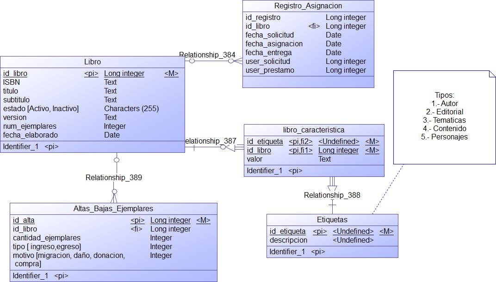

# Evaluación técnica para Backend Developer

Bienvenid@ a la prueba técnica que hemos diseñado para los postulantes al cargo de Desarrollador backend.

#### Importante: ####
*Una vez desarrollada la prueba por favor subir tu código a un repositorio remoto (Github, Gitlab, Bitbucket, etc), y enviarnos el enlace al correo jsalazar@links.com.ec donde deben incluirse todas las instrucciones para que podamos ejecutar tu trabajo de manera local y hacer las respectivas revisiones.*

#### Requerimientos técnicos: ####
**El siguiente ejercicio debe estar desarrollado en el Framework Laravel, puede estar en cualquier version superior a la 5.4 sin embargo sugerimos la 8.0**

En caso de preguntas dirigete a: *jsalazar@links.com.ec*, usando el asunto [Backend-Test]

Buena suerte!

#### Enunciado

La empresa Links S.A. requiere el desarrollo del módulo de biblioteca, para registro de préstamo de libros y altas y bajas de ejemplares.

- Se requiere el desarrollo de un endpoint que permita listar los libros disponibles.
- Desarrollo de un endpoint que permita registrar el préstamo del libro a un usuario X (guardar unicamente el nombre como referencia al usuario, tanto para el usuario que realizó la solicitud como para el que lo prestó).
- Los libros tienen características como son el autor, editorial, temáticas, contenido personajes, cada una de estas características deben almacenarse en la tabla etiquetas. Cada recurso (Autor, Editorial, etc) debe manejarse a través de herencia de clases en la aplicación
- El endpoint de listar los libros debe permitir filtrar por Autor, Editorial y/o Temáticas.
- Desarrollo de un endpoint que permita dar de alta a un libro, tomando en cuenta que la cantidad de ejemplares debe aumentar, tipo = ingreso, y el detallar el motivo (migración, daño, donación, compra). Se recomienda utilizar enumeraciones.

Usted dispone de 02:30h para llevar a cabo esta prueba. Tiene total libertad para realizar búsquedas en Google de ser necesario.

#### Consideraciones
Se evaluará la escritura de un código limpio, reutilizable, tratamiento de errores, buen manejo de la tencología, además del funcionamiento de las api.